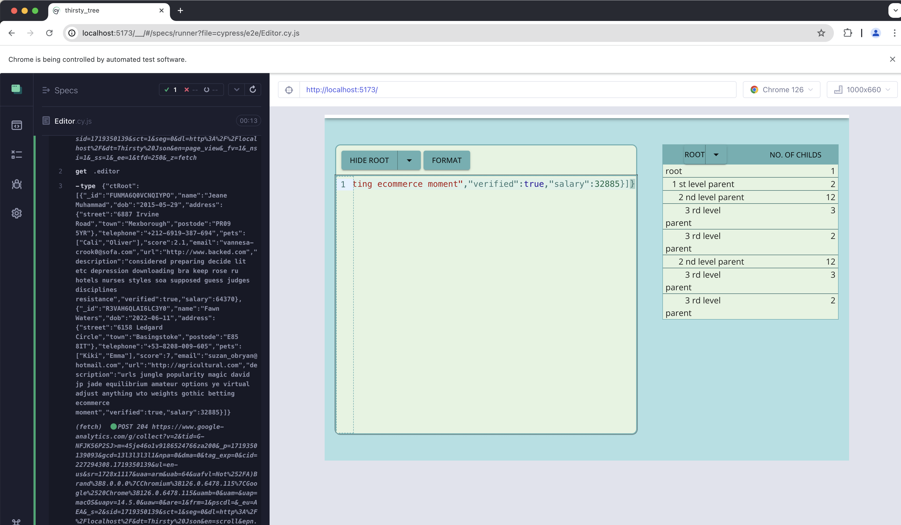

**1. How to run the project locally**

Run the following commands to setup the project:

-`$npm i`

-`$npm run dev`

Step 1 installs all the packages

Step 2 Runs the server , which willl give you a local host URL


```
➜  thirsty_tree git:(TT-DV06-cypress) npm run dev  

> thirstytree_cm@0.0.0 dev
> vite


  VITE v5.3.0  ready in 346 ms

  ➜  Local:   http://localhost:5173/
  ➜  Network: use --host to expose
  ➜  press h + enter to show help
```
---
** 2. How to test the project using cypress**

Run the project following commands

run the project locally to get the local host url. In another command line session run the following command

`$npm run cy-open`

```

$npm run cy-open

thirstytree_cm@0.0.0 cy-open
cypress open

```

This will open a cypress server


You can edit the tests in `cypress/e2e/Editor.cy.js`



